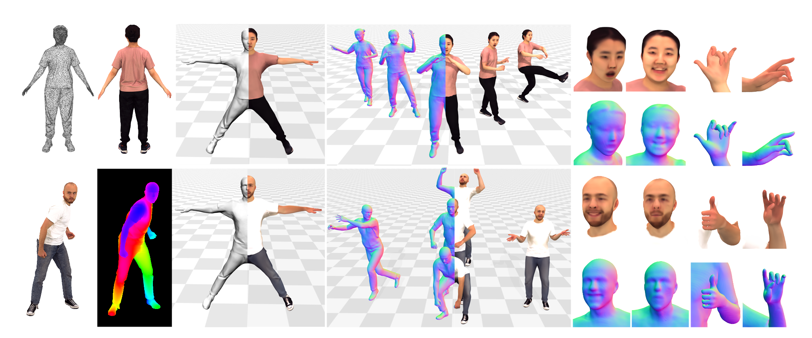
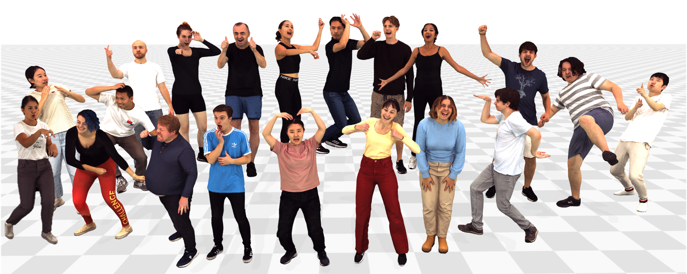
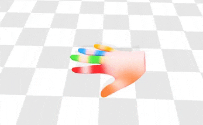
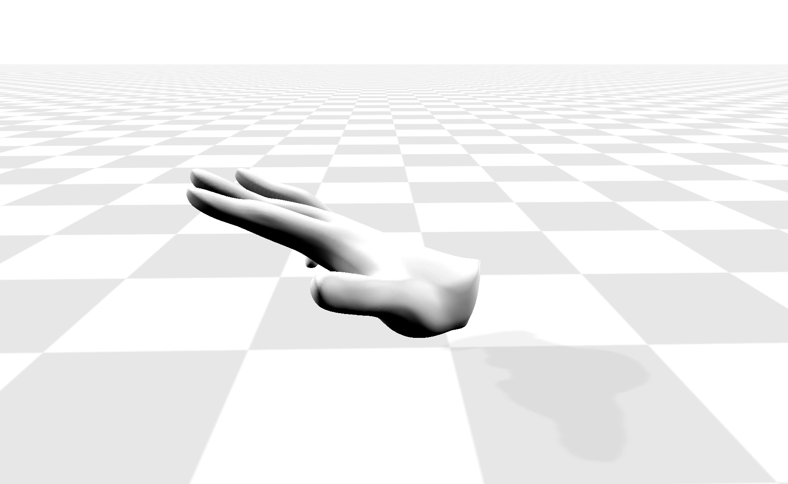

# X-Avatar: Expressive Human Avatars
## [Project Page](https://skype-line.github.io/projects/X-Avatar/) | [Paper](https://arxiv.org/abs/2303.04805) | [SuppMat](https://skype-line.github.io/projects/X-Avatar/static/doc/Expressive_Human_Avatars_Suppmat.pdf) | [Video](https://youtu.be/JniKF88aPcs) | [Data](https://forms.gle/rHZgZnmUJnFuZUi48)


 

Official Repository for CVPR 2023 paper [*X-Avatar: Expressive Human Avatars*](https://arxiv.org/abs/2303.04805). We propose an animatible implicit human avatar model capable of capturing human body pose, hand pose, facial expressions, and appearance. X-Avatar can be created from 3D scans or RGB-D images. We also contribute a new dataset, called [X-Humans](https://forms.gle/rHZgZnmUJnFuZUi48), containing 233 sequences of high-quality textured scans from 20 participants, totalling about 35,500 data frames.


# Getting Started
Clone this repo:
```
git clone https://github.com/Skype-line/X-Avatar.git
cd X-Avatar
```

Install environment:
```
conda env create -f environment.yml
conda activate xavatar
python setup.py install
```

Download [SMPL-X](https://smpl-x.is.tue.mpg.de) (v1.1, we only use first 10 shape PCs and first 10 expression PCs) models and move them to the corresponding places:
```
mkdir code/lib/smplx/smplx_model/
mv /path/to/SMPLX_FEMALE.npz code/lib/smplx/smplx_model/SMPLX_FEMALE.npz
mv /path/to/SMPLX_MALE.npz code/lib/smplx/smplx_model/SMPLX_MALE.npz
```

# Quick Demo

 


Download our pretrained models, part labels information of SMPL-X models and demo sequences from [Google Drive](https://drive.google.com/drive/folders/10DIIhcL3aFwGq1utg5HEcjd2We8JiZth). The motions are extracted by [PyMAF-X](https://github.com/HongwenZhang/PyMAF-X) from monocular RGB videos.
```
mkdir -p outputs/XHumans_smplx
mv /path/to/pretrained_model/* outputs/XHumans_smplx
mv /path/to/part_label/* code/lib/smplx/smplx_model
```

First, `cd code`,

Run a quick demo on X-Avatars learned from 3D scans:
```
python demo.py subject=00085_scan experiments=XHumans_occ_smplx demo.motion_path=/path/to/ballet_dance_smoothed.pkl
```

Run a quick demo on X-Avatars learned from RGB-D images:
```
python demo.py subject=00034_rgbd experiments=XHumans_sdf_smplx demo.motion_path=/path/to/tennis_smoothed.pkl
```

Saved meshes can be visualized with [aitviewer](https://github.com/eth-ait/aitviewer):
```
python vis_meshes.py --data_root=../outputs/XHumans_smplx/00085_scan/ballet_dance_smoothed
```

Some motion sequences have high fps and one might want to skip some frames. To do this, add `demo.every_n_frames=x` to consider every x frame in the motion sequence.


# Training and Evaluation

## Prerequisites

Install [kaolin](https://kaolin.readthedocs.io/en/v0.12.0/notes/installation.html) for fast occupancy query from meshes. We use version 0.12.0.
```
git clone https://github.com/NVIDIAGameWorks/kaolin
cd kaolin
git checkout v0.12.0
python setup.py develop
```

Download initialization models from [Google Drive](https://drive.google.com/drive/folders/10DIIhcL3aFwGq1utg5HEcjd2We8JiZth), and move them to the corresponding places:
```
mv /path/to/init_model code/init_model
```


## X-Humans (Textured Clothed Human)
 

### Prepare Datasets
Download our [X-Humans](https://forms.gle/rHZgZnmUJnFuZUi48) dataset and preprocess the dataset. You can find more details about the dataset in [data_process/README.md](data_process/README.md).
```
python data_process/preprocess_XHumans.py --data_root=/path/to/XHumans/Dataset/{Person_ID}
```

### Training
First, `cd code`,

Run the following command to train X-Avatars from 3D scans:
```
python train.py subject={Person_ID}_scan datamodule=XHumans_scan_smplx experiments=XHumans_occ_smplx datamodule.dataloader.dataset_path=/path/to/XHumans/Dataset/{Person_ID}
```
Results are saved in `../outputs/XHumans_smplx/{Person_ID}_scan`.


Run the following command to train X-Avatars from RGB-D images:
```
python train.py subject={Person_ID}_rgbd datamodule=XHumans_rgbd_smplx experiments=XHumans_sdf_smplx datamodule.dataloader.dataset_path=/path/to/XHumans/Dataset/{Person_ID}
```
Results are saved in `../outputs/XHumans_smplx/{Person_ID}_rgbd`.

Training logs are available on [wandb](https://wandb.ai/home) (registration needed, free of charge). It should take ~24h on a single Nvidia RTX 6000 GPU. If you want to train on a single 2080Ti GPU, you can reduce either the batch size `datamodule.dataloader.batch_size` or the number of sampled points `datamodule.processor.points_per_frame`. If you want to resume training from the last checkpoint, add `experiments.resume=true` to the command.

### Testing
You can use the trained model to generate animation using motions in test split of X-Humans dataset (Similar to Quick Demo):

First, `cd code`,

Test X-Avatars learned from 3D scans:
```
python test.py subject={Person_ID}_scan experiments=XHumans_occ_smplx demo.motion_path=/path/to/XHumans/Dataset/{Person_ID}/test
```

Test X-Avatars learned from RGB-D images:
```
python test.py subject={Person_ID}_rgbd experiments=XHumans_sdf_smplx demo.motion_path=/path/to/XHumans/Dataset/{Person_ID}/test
```

Evaluate outputs:
```
python evaluate.py --pd_dir=../outputs/XHumans_smplx/{Person_ID}_scan --gt_dir=/path/to/XHumans/Dataset/{Person_ID} --mode=test
```
Metrics including volumetric IoU, Chamfer distance (CD) (mm) and normal consistency (NC) both globally and per part will be printed and saved in `{mode}_metrics.npz`.

## GRAB (Minimally Clothed Human)

### Prepare Datasets
Install [PyMesh](https://pymesh.readthedocs.io/en/latest/installation.html)

Download the [GRAB](https://amass.is.tue.mpg.de/) dataset (SMPL-X G), choose any subject, split motion sequences into training and testing splits and run:
```
python data_process/preprocess_GRAB.py --data_root=/path/to/GRAB/Dataset/{Person_ID} --gender=GENDER --model_root=/path/to/SMPL(-H/X)/models
```

### Training

```
cd code
python train.py subject={Person_ID}_scan datamodule=amass_smplx experiments=amass_smplx datamodule.dataloader.dataset_path=/path/to/GRAB/Dataset/{Person_ID}
```
Results are saved in `../outputs/amass_smplx/{Person_ID}_scan`.


### Testing
```
cd code
python test.py subject={Person_ID}_scan experiments=amass_smplx demo.motion_path=/path/to/GRAB/Dataset/{Person_ID}/test
```

# Extension
## SMPL Version
### Prerequisites
Download [SMPL](https://smpl.is.tue.mpg.de) (1.0.0 for Python 2.7 (10 shape PCs)) models and move them to the corresponding places: 
```
mkdir code/lib/smplx/smpl_model/
mv /path/to/basicModel_f_lbs_10_207_0_v1.0.0.pkl code/lib/smplx/smpl_model/SMPL_FEMALE.pkl
mv /path/to/basicmodel_m_lbs_10_207_0_v1.0.0.pkl code/lib/smplx/smpl_model/SMPL_MALE.pkl
```

### Training
You can easily try SMPL version of X-Avatars by changing `datamodule` and `experiments`. For example, to train X-Avatars from 3D scans using SMPL skeleton:
```
cd code
python train.py subject={Person_ID}_scan datamodule=XHumans_scan_smpl experiments=XHumans_occ_smpl datamodule.dataloader.dataset_path=/path/to/XHumans/Dataset/{Person_ID}
```
Results of SMPL version are saved in `../outputs/XHumans_smpl/{Person_ID}_scan`.

### Testing
```
cd code
python test.py subject={Person_ID}_scan experiments=XHumans_occ_smpl demo.motion_path=/path/to/XHumans/Dataset/{Person_ID}/test
```


## MANO Version

<p float="left">
   
  
</p>


### Prerequisites
Download [MANO](https://mano.is.tue.mpg.de) models and move them to the corresponding places: 
```
mkdir code/lib/smplx/mano_model/
mv /path/to/MANO_RIGHT.pkl code/lib/smplx/mano_model/MANO_RIGHT.pkl
mv /path/to/MANO_LEFT.pkl code/lib/smplx/mano_model/MANO_LEFT.pkl
```

### Prepare Datasets
Download the [dataset](https://mano.is.tue.mpg.de) containing MANO training Scans' Registrations (Right hand, Left hand, Left hand mirrored) and Model Parameters, convert it to our data format and separate into training and testing splits:
```
python data_process/preprocess_MANO.py --data_root=/path/to/manoposesv10/mano_poses_v1_0 --model_root=../code/lib/smplx/mano_model/MANO_RIGHT.pkl
```

### Training
You can train an implicit hand model from MANO by running:
```
cd code
python train.py subject=1 datamodule=mano experiments=mano datamodule.dataloader.dataset_path=/path/to/MANO/dataset
```
Results of MANO version are saved in `../outputs/mano/1`.

### Testing
You can use the trained model to generate animation using motions in the test split:
```
cd code
python test.py subject=1 experiments=mano demo.motion_path=/path/to/MANO/dataset/test demo.resolution=256
```


# Acknowledgement
We have used codes from other great research work, including [SMPL-X](https://github.com/vchoutas/smplx), [SNARF](https://github.com/xuchen-ethz/snarf), [IGR](https://github.com/amosgropp/IGR), [IDR](https://github.com/lioryariv/idr), [NASA](https://github.com/tensorflow/graphics/tree/master/tensorflow_graphics/projects/nasa), [DEQ](https://github.com/locuslab/deq) and [PyMAF-X](https://github.com/HongwenZhang/PyMAF-X). We sincerely thank these authors for their awesome work.


# Related Works
Here are more recent related human body reconstruction projects from our team:

* [Guo et. al. - Vid2Avatar: 3D Avatar Reconstruction from Videos in the Wild via Self-supervised Scene Decomposition](https://github.com/MoyGcc/vid2avatar)
* [Jiang and Chen et. al. - InstantAvatar: Learning Avatars from Monocular Video in 60 Seconds](https://github.com/tijiang13/InstantAvatar)
* [Yin et. al. - Hi4D: 4D Instance Segmentation of Close Human Interaction](https://github.com/yifeiyin04/Hi4D)


If you find our code, dataset or paper useful, please cite as
```
@inproceedings{shen2023xavatar,
      title={X-Avatar: Expressive Human Avatars},
      author={Shen, Kaiyue and Guo, Chen and Kaufmann, Manuel and Zarate, Juan and Valentin, Julien and Song, Jie and Hilliges, Otmar},    
      journal   = {Computer Vision and Pattern Recognition (CVPR)},
      year      = {2023}
    }
```